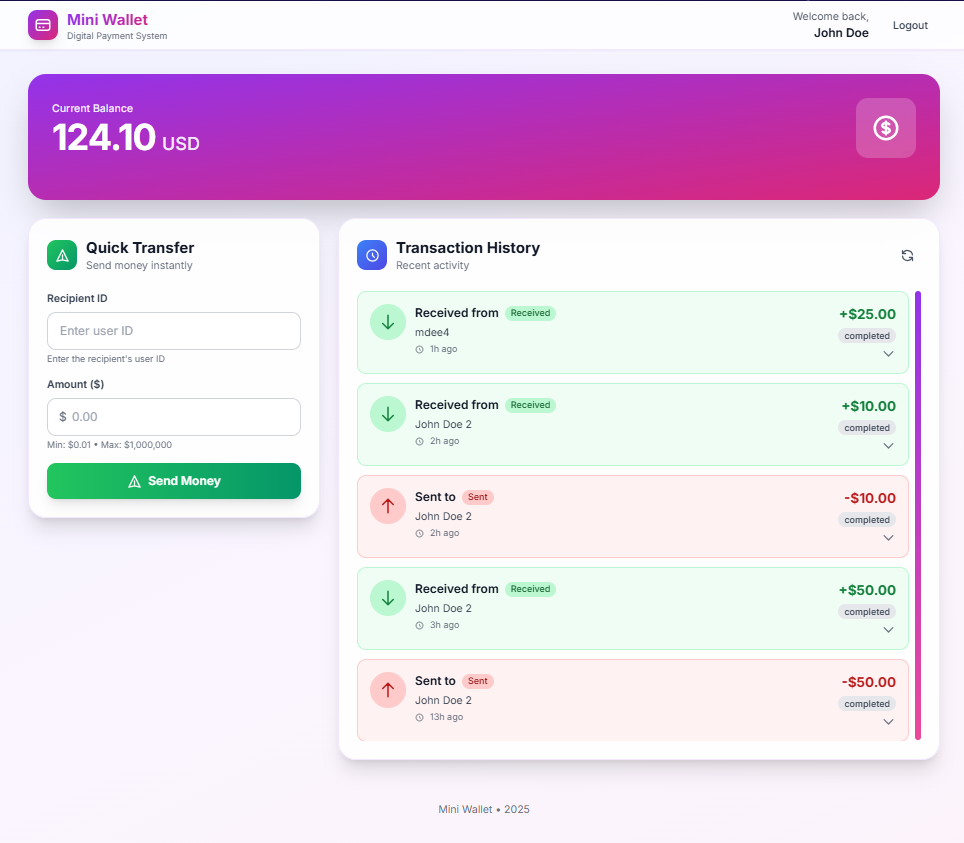

# Mini Wallet Application

> A digital wallet application built with Laravel 12 and Vue.js, featuring secure money transfers, real-time updates via Pusher, and comprehensive test coverage.



## ✨ Features

- **Secure Money Transfers** - Atomic transactions with pessimistic locking to prevent race conditions
- **1.5% Commission** - Automatic commission calculation on all transfers
- **Real-time Updates** - Pusher broadcasting for instant balance and transaction notifications
- **API Authentication** - Laravel Sanctum token-based authentication
- **Rate Limiting** - 10 transfers per minute to prevent abuse
- **Comprehensive Testing** - 42 tests (171 assertions) covering unit, feature, concurrency, and broadcasting scenarios
- **Clean Architecture** - Repository pattern, Service layer, DTOs, and Event-driven design

## 🛠️ Tech Stack

### Backend
- **Laravel 12.38.1** - PHP 8.3+ framework
- **MySQL 8.0** - Database
- **Laravel Sanctum** - API token authentication
- **Pusher** - Real-time broadcasting
- **Pest PHP** - Modern testing framework

### Architecture Patterns
- **Repository Pattern** - Abstracted data access layer
- **Service Layer** - Business logic isolation
- **DTO Pattern** - Type-safe data transfer objects (readonly PHP 8.3)
- **Event-Driven** - Pusher broadcasting for real-time updates

### Frontend
- **Vue 3** with Composition API
- **Pinia** for state management
- **Vite** for lightning-fast build tooling
- **Tailwind CSS** for beautiful, responsive UI
- **Laravel Echo** for WebSocket subscriptions
- **Real-time notifications** with animated toasts

## 📋 Requirements

- PHP 8.3 or higher
- Composer 2.x
- MySQL 8.0 or higher
- Node.js 20+ (optional, for frontend if needed)
- Pusher account (for real-time features)

## 🚀 Installation & Setup

### 1. Clone the Repository

```bash
git clone https://github.com/MDeeee/mini-wallet.git
cd mini-wallet
```

### 2. Install Dependencies

```bash
composer install
```

### 3. Configure Environment

```bash
# Copy environment file
cp .env.example .env

# Generate application key
php artisan key:generate
```

### 4. Configure Database

Create a MySQL database and update your `.env` file:

```env
DB_CONNECTION=mysql
DB_HOST=127.0.0.1
DB_PORT=3306
DB_DATABASE=mini_wallet
DB_USERNAME=root
DB_PASSWORD=your_password
```

### 5. Configure Pusher (Required for Real-time Features)

Sign up for a free Pusher account at [https://pusher.com](https://pusher.com) and update your `.env`:

```env
BROADCAST_CONNECTION=pusher
PUSHER_APP_ID=your_app_id
PUSHER_APP_KEY=your_app_key
PUSHER_APP_SECRET=your_app_secret
PUSHER_APP_CLUSTER=your_cluster
PUSHER_VERIFY_SSL=false  # Only for local development
```

**Note:** For local development, you may need to disable SSL verification. Remove `PUSHER_VERIFY_SSL=false` in production.

### 6. Run Migrations

```bash
php artisan migrate
```

### 7. Optional: Seed Test Data

```bash
php artisan db:seed
```

### 8. Start the Application

```bash
# Start Laravel development server
php artisan serve

# Application will be available at http://localhost:8000
```

## 🧪 Testing

The application includes comprehensive test coverage:

```bash
# Run all tests (42 tests, 171 assertions)
php artisan test

# OR use Pest directly
./vendor/bin/pest

# Run specific test suite
php artisan test --filter=TransferServiceTest
```

### Test Coverage

- **Broadcasting Tests** (8 tests)
  - Event dispatch after successful transfer
  - Event broadcast to correct channels (sender and receiver)
  - Event data format validation
  - Event not dispatched on failure
  - Private channel authorization

- **Unit Tests** (11 tests)
  - Transfer service business logic
  - Commission calculation (1.5%)
  - Exception handling
  - Edge cases and boundary conditions

- **Feature Tests** (13 tests)
  - API endpoint authentication
  - Transaction creation and retrieval
  - Input validation (all scenarios)
  - Rate limiting enforcement
  - Balance updates verification

- **Concurrency Tests** (3 tests)
  - Race condition prevention
  - Double-spending protection
  - Deadlock prevention with consistent locking

## 📡 API Documentation

### Postman Collection

Import the included Postman collection for easy API testing:
- **File:** `Mini-Wallet-API.postman_collection.json`
- **Environment:** `Mini-Wallet-Local.postman_environment.json`

The collection includes:
- ✅ Authentication endpoints (Register, Login, Logout)
- ✅ Transaction endpoints (Transfer Money, Get History)
- ✅ Auto-save authentication tokens
- ✅ Example requests and responses

### Authentication

All API endpoints (except register/login) require authentication via Laravel Sanctum tokens.

```bash
# Register a new user
POST /api/register
Content-Type: application/json

{
  "name": "John Doe",
  "email": "john@example.com",
  "password": "password123",
  "password_confirmation": "password123"
}

# Login and receive token
POST /api/login
Content-Type: application/json

{
  "email": "john@example.com",
  "password": "password123"
}

# Response
{
  "user": {
    "id": 1,
    "name": "John Doe",
    "email": "john@example.com",
    "balance": "$100.00",
    "balance_cents": 10000
  },
  "token": "1|abc123..."
}
```

### Transactions

#### Get Transaction History

```bash
GET /api/v1/transactions
Authorization: Bearer {token}

# Response
{
  "balance": {
    "amount": "100.00",
    "amount_cents": 10000,
    "currency": "USD"
  },
  "transactions": {
    "data": [
      {
        "id": 1,
        "sender": {
          "id": 1,
          "name": "John Doe"
        },
        "receiver": {
          "id": 2,
          "name": "Jane Doe"
        },
        "amount": {
          "amount": "50.00",
          "amount_cents": 5000,
          "currency": "USD"
        },
        "commission_fee": {
          "amount": "0.75",
          "amount_cents": 75,
          "currency": "USD"
        },
        "status": "completed",
        "created_at": "2025-01-15T10:30:00.000000Z"
      }
    ],
    "next_cursor": null,
    "next_page_url": null,
    "path": "http://localhost:8000/api/v1/transactions",
    "per_page": 15,
    "prev_cursor": null,
    "prev_page_url": null
  }
}
```

#### Transfer Money

```bash
POST /api/v1/transactions
Authorization: Bearer {token}
Content-Type: application/json

{
  "receiver_id": 2,
  "amount": 50.00
}

# Response (201 Created)
{
  "message": "Transfer successful",
  "transaction": {
    "id": 1,
    "sender": {
      "id": 1,
      "name": "John Doe"
    },
    "receiver": {
      "id": 2,
      "name": "Jane Doe"
    },
    "amount": {
      "amount": "50.00",
      "amount_cents": 5000,
      "currency": "USD"
    },
    "commission_fee": {
      "amount": "0.75",
      "amount_cents": 75,
      "currency": "USD"
    },
    "status": "completed",
    "created_at": "2025-01-15T10:30:00.000000Z"
  },
  "new_balance": {
    "amount": "949.25",
    "amount_cents": 94925,
    "currency": "USD"
  }
}
```

#### Validation Rules

- `receiver_id`: Required, must exist, cannot be sender
- `amount`: Required, numeric, min: 0.01, max: 1,000,000

#### Error Responses

```json
// 422 Validation Error
{
  "message": "The receiver id field is required. (and 1 more error)",
  "errors": {
    "receiver_id": ["The receiver id field is required."],
    "amount": ["The amount must be at least 0.01."]
  }
}

// 422 Insufficient Balance
{
  "message": "Insufficient balance for user 1. Required: 50.75, Available: 30.00"
}

// 401 Unauthenticated
{
  "message": "Unauthenticated."
}

// 429 Too Many Requests
{
  "message": "Too many attempts. Please try again in 60 seconds."
}
```

### Real-time Events (Pusher Broadcasting)

After a successful transfer, a `money.transferred` event is broadcast to both sender and receiver via private Pusher channels:

**Event Name:** `money.transferred`  
**Channels:** `private-user.{senderId}` and `private-user.{receiverId}`

**Event Data:**
```json
{
  "transaction_id": 1,
  "sender_id": 1,
  "receiver_id": 2,
  "amount": 50.00,
  "commission_fee": 0.75,
  "sender_new_balance": 949.25,
  "receiver_new_balance": 1050.00,
  "timestamp": "2025-01-15T10:30:00.000000Z"
}
```

**Frontend Integration (Laravel Echo):**
```javascript
// Subscribe to user's private channel
Echo.private(`user.${userId}`)
  .listen('.money.transferred', (event) => {
    console.log('Transaction ID:', event.transaction_id);
    console.log('Amount:', event.amount);
    console.log('New Balance:', event.sender_new_balance);
    
    // Update UI in real-time
    updateBalance(event.sender_new_balance);
    addTransactionToList(event);
  });
```

## 🏗️ Architecture

### Database Schema

**Users Table**
- `id`: Primary key
- `name`: User full name
- `email`: Unique email address
- `balance`: Unsigned BigInteger - User wallet balance in cents (default: 10000 = $100.00)
- `created_at`, `updated_at`: Timestamps

**Transactions Table**
- `id`: Primary key
- `sender_id`: Foreign key → users.id (cascade delete)
- `receiver_id`: Foreign key → users.id (cascade delete)
- `amount`: Integer - Transfer amount in cents
- `commission_fee`: Integer - 1.5% commission in cents
- `status`: ENUM('pending', 'completed', 'failed')
- `created_at`: Timestamp (no updated_at)

### Design Patterns

1. **Repository Pattern**
   - Abstracts data access logic
   - Enables easy testing with mocks
   - Located in `app/Repositories/`

2. **Service Layer**
   - Contains business logic
   - Handles complex operations (e.g., money transfers)
   - Located in `app/Services/`

3. **DTO Pattern**
   - Readonly PHP 8.3 classes for type safety
   - Encapsulates request/response data
   - Located in `app/DTOs/`

4. **Event-Driven Architecture**
   - `MoneyTransferred` event triggers real-time updates
   - Broadcasts to private Pusher channels
   - Located in `app/Events/`

### Concurrency & Race Condition Prevention

The application uses **pessimistic locking** to prevent race conditions:

```php
// In TransferService.php
DB::transaction(function () use ($dto) {
    // Lock users in consistent order (prevents deadlocks)
    $userIds = [$senderId, $receiverId];
    sort($userIds);
    
    // Lock both users for update
    User::whereIn('id', $userIds)
        ->lockForUpdate()
        ->get();
    
    // Validate and execute transfer atomically
    // ...
});
```

Key features:
- ✅ Atomic database transactions
- ✅ `lockForUpdate()` prevents concurrent modifications
- ✅ Consistent locking order prevents deadlocks
- ✅ Balance validation before debit
- ✅ Automatic rollback on exceptions

## 🔧 Configuration

### Environment Variables

```bash
# Application
APP_NAME="Mini Wallet"
APP_ENV=local
APP_DEBUG=true
APP_KEY=base64:...

# Database
DB_CONNECTION=mysql
DB_HOST=127.0.0.1
DB_PORT=3306
DB_DATABASE=mini_wallet
DB_USERNAME=root
DB_PASSWORD=

# Pusher Broadcasting (Required)
BROADCAST_CONNECTION=pusher
PUSHER_APP_ID=your_app_id
PUSHER_APP_KEY=your_app_key
PUSHER_APP_SECRET=your_app_secret
PUSHER_APP_CLUSTER=mt1
```

## 📈 Performance Features

- **Database Indexing**: Composite indexes on `transactions(sender_id, created_at)` and `transactions(receiver_id, created_at)`
- **Pessimistic Locking**: `lockForUpdate()` prevents race conditions
- **Rate Limiting**: 10 requests/minute per user on transfer endpoint
- **Query Optimization**: Eager loading relationships, selective column retrieval
- **Atomic Transactions**: Database-level consistency with automatic rollback

## 🚀 Production Deployment

### Server Requirements

- PHP 8.3+
- MySQL 8.0+
- Composer 2.x
- Nginx or Apache
- Supervisor (for queue workers, optional)

### Production Optimization

```bash
# Cache configuration
php artisan config:cache
php artisan route:cache
php artisan view:cache

# Run migrations
php artisan migrate --force
```

## 📝 Development Notes

### Adding New Features

When extending the application for enterprise use, consider:

1. **CQRS Pattern**: Separate read/write models for scalability
2. **Event Sourcing**: Store all balance changes as events
3. **Idempotency**: Add request IDs to prevent duplicate transactions
4. **Saga Pattern**: Handle complex multi-step transactions
5. **Microservices**: Split into User, Wallet, Transaction, Notification services
6. **Database Partitioning**: Implement quarterly/yearly range partitioning on `transactions.created_at` for high-volume scenarios (millions+ records)
7. **Data Archival Strategy**: Automate moving old transactions (>12 months) to `archived_transactions` table for compliance and performance

### Scalability Note

The current implementation uses standard foreign key constraints for simplicity and clarity. For production systems handling millions of transactions, consider implementing time-based partitioning strategies with appropriate data archival processes.

### Caching Strategy

**Intentionally Not Implemented** - Financial transaction data is never cached to ensure real-time accuracy and prevent stale balance information. Pusher provides instant updates, and pessimistic locking requires fresh database reads. For production at scale, consider caching only non-financial data like user profiles or aggregated statistics with Redis.

### Code Style

```bash
# Run Laravel Pint for code formatting
./vendor/bin/pint

# Check for code quality issues
./vendor/bin/phpstan analyse
```
